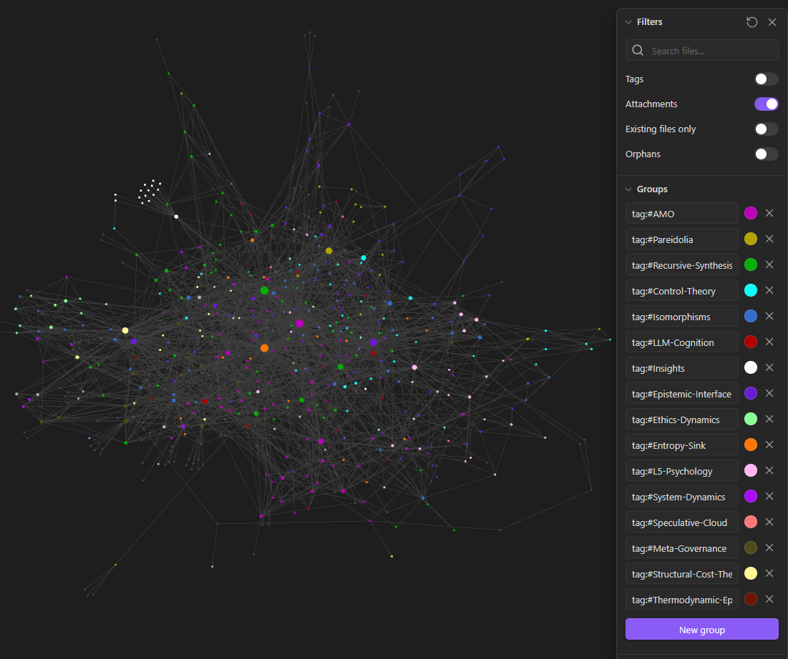

<h2 align="center">AMO Knowledge Graph</h2>

  

  <em>Snapshot of AMO-related Obsidian vault nodes (2026-01-31)</em>

Greggory Rodriguez  
Independent Researcher   
Research Collaboration Splash Page  
https://grodriguez6.github.io/amo-collab  
#amo-collab #recursive-synthesis #pareidolia #entropy-sink #isomorphisms #control-theory #epistemology  
  
  
Currently active and ongoing research:  
• Artificial Intelligence & AGI — architectures, limitations, convergence  
• Human perception, predictive processing, and inference  
• Structural and algorithmic isomorphisms across systems  
• Epistemic reliability and error correction through systems engineering  
  
  
Featured Work  
Plasma Pareidolia (Preprint)  
A working demonstration of the approach: a terrestrial, physics-based explanation of high-energy atmospheric anomalies, shaped by how the brain’s predictive processing interprets them.  
  
The Method  
AMO (Adversarial Multi-Model Orchestration) is the engine behind this work — a research methodology designed to:  
01 Run multiple competing hypotheses in parallel.  
02 Force synthesis through structured disagreement.  
03 Compress iteration cycles from years into weeks.  
AMO is not automation. It’s a way of thinking and working. AI models and human orchestrators forming a collaborative intelligence for rapid hypothesis generation, critique, and synthesis.  
  
  
The Results / Artifacts  
Case Study // The Seed  
Plasma Pareidolia  
From concept to hypothesis in 8 days.  
A unifying terrestrial framework addressing a large class of reported UAP phenomena.  
  
  
AMO (The Engine)   →   https://zenodo.org/records/17919520  
Recursive Synthesis (Algorithm of Discovery)   →   https://zenodo.org/records/17919782  
Entropy Sink (The Universal Constraint)   →   https://zenodo.org/records/18020699  
Generalized Pareidolia (The Reality of Perception)   →   https://zenodo.org/records/18182005  
  
  
What I’m Building  
A small, open research collective organized around methods and artifacts, not credentials or institutions.  
  
Current Value Proposition:  
  
/  Direct Onboarding: Direct collaboration with the AMO founder on active research problems.  
/  Credit & Attribution: Your research. Your discoveries. Co-authored, citable outputs (DOIs).  
/  Zero Latency: Collaboration without gatekeeping or hierarchy.  
  
The research has grown too big for one person.  
If you’re capable, curious, and ambitious, reach out.  
  
  
  
Discord:   
https://discord.gg/MfbHn75X  
Email:  
grodriguez6@gatech.edu  
greggory.rodriguez6@yahoo.com  
